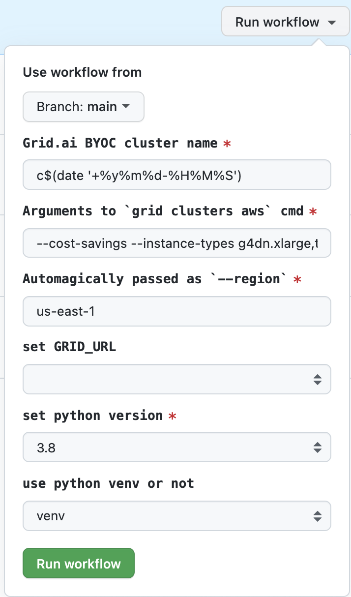

Grid.ai [BYOC Cluster creation](https://docs.grid.ai/platform/upgrades/adding-custom-cloud-credentials) demo.

# Create
## Create Cluster Simple

This allows Grid.ai to create the AWS EKS cluster, then link this cluster to Grid.ai control plane.  

- setup GitHub Secrets
  - `AWS_ACCESS_KEY_ID` and `AWS_SECRET_ACCESS_KEY` 
    - Follow instructions from [Grid.ai BYOC AWS Credentials](https://docs.grid.ai/platform/upgrades/adding-custom-cloud-credentials)
  - `GRIDAI_KEY` and `GRIDAI_USERNAME` 
    - Follow instructions from [Grid.ai login](https://docs.grid.ai/products/global-cli-configs/cli-api/grid-login)
- Go to [GitHub Actions GUI form](https://github.com/robert-s-lee/grid-byoc/actions/workflows/cluster-create.yml) 
  - Fill out and click `Run Workflow`  

- Wait about 20 min the script to finish.
  - the GitHub Action log will show the cluster name.

## Create Cluster with manual AWS EKS

This allows AWS EKS cluster create by you, then link this cluster to Grid.ai control plane. 

# Delete

# Update
